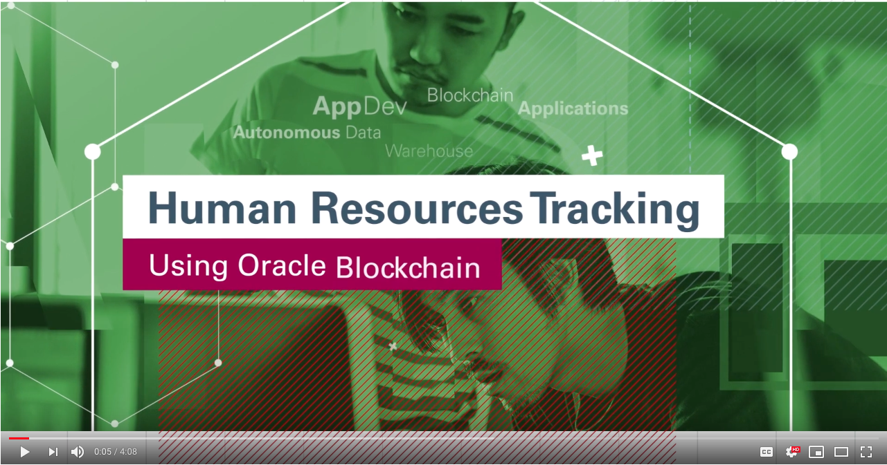
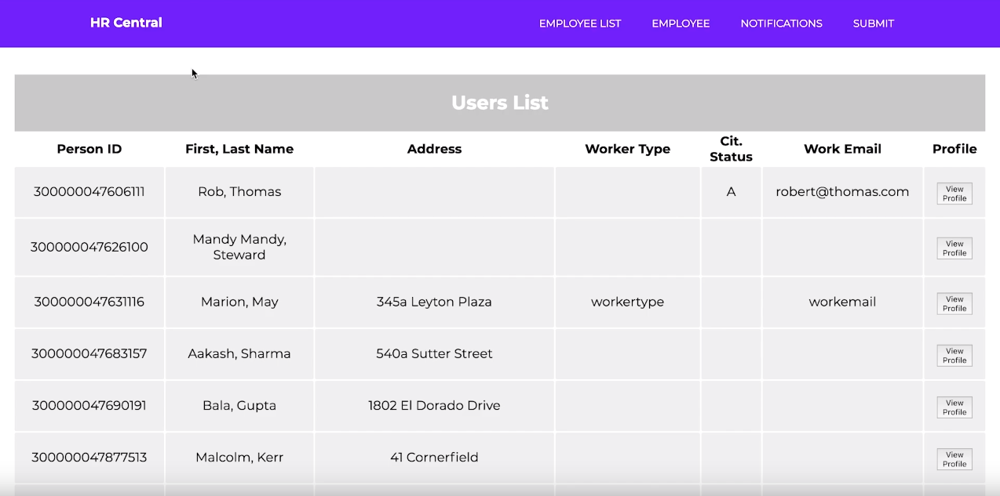
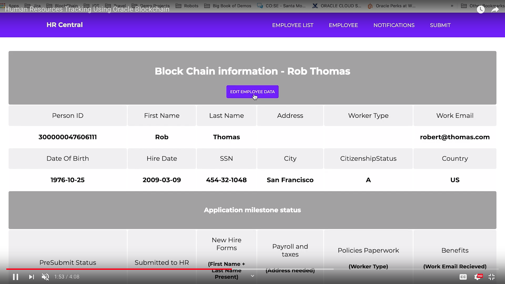
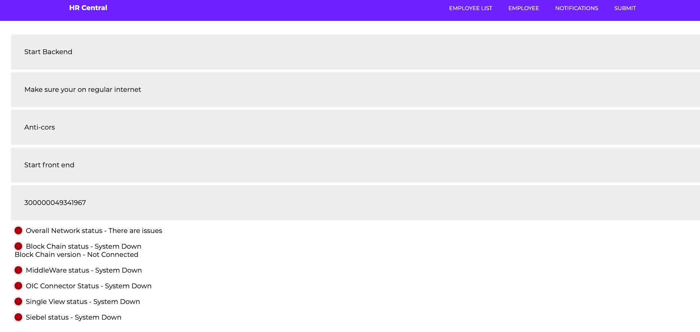

# Assets-IO_A2 Human Resources Applications tracking


This application is designed in order for the HR and employees to be able track actions and documents for candidates, prospective employees and current employees from their inital hire to departure of employee.


Main Priorities of this project:

* Save time and money on the IT level
* Save money in HR costs due to lowered micromangement
* Integrating upstream and downstream processes and reduce human error
* Develop real-time actionable insight
* Reduce time to authenticate and record documentation to candidate

[](https://www.youtube.com/watch?v=fiVH_93XT3w)

## Getting Started

These instructions will get you a copy of the project up and running on your local machine for development and testing purposes. See deployment for notes on how to deploy the project on a live system.

The blockchain side of the application will not record data unless a blockchain instance has been provisioned and connected with the appropriate chaincode.


## Pages

**Employee List** - Shows the various Employees that the Blockchain contains as well as their various attributes. These attributes are such as person id, ferst and alst name, address, worker type, citizen status, work email and profile



**Employee Page** - When selected on the employee list page, the profile page shows the various details of the employee.



**Notifications** - This is a custom dashboard that shows all the overal statuses of the components of the application.



**Submit page** - Asset submission test page used to submit assets into the blockchain for testing.


	- Overall Network status - Overall check of any of the components and if any of them don't work, this will be red
	- Blockchain status - Check if the blockchain is up and running
	- Blockchain version - Shows current version of the chaincode
	- OIC connector - Check if the connector is running
	- Single View - Check if the single view application is responding
	- Siebel status - Current status of Siebel software


### Prerequisities
------
- Node JS
- Angular CLI
- NPM

Installing without Brew

```
curl "https://nodejs.org/dist/latest/node-${VERSION:-$(wget -qO- https://nodejs.org/dist/latest/ | sed -nE 's|.*>node-(.*)\.pkg</a>.*|\1|p')}.pkg" > "$HOME/Downloads/node-latest.pkg" && sudo installer -store -pkg "$HOME/Downloads/node-latest.pkg" -target "/"
npm install -g @angular/cli
```


With homebrew

```
brew install node
brew install angular-cli
```

### Installing
------
The application is a multipart application which has three parts. 

Front end - Interfaces with the middleware inorder to show all the data 

Middleware - interfaces with the blockchain and holds all the api interfaces

Blockchain - records all the data for immutiblity 

## Deployment and Using the App


#### Creating blockchain instance

This guide is made with the assumtion that a blockchain instance has already been created. In order to create a blockchain, if one is not available please follow the creating a blockchain instance guide.

#### Checking the blockchain for runtime

1. Access block chain from www.cloud.oracle.com
2. Click on signin on the top bar
3. Sign into the tenancy 
4. Sign in with your SSO in order to access the environement
5. Double check your instance is running in the list
6. In order to check any details of the instance click on the hamburger menu to the left of the instance


Checklist:


To run the project:

Start Backend 
- Go to Backend folder
- In terminal - NPM Start

Start Front end :
- Go to front end folder
- NPM Start

- Localhost:4200

#### Starting the Backend

```
cd Backend
npm install
npm start

```


#### Starting the Frontend

- Make sure cors on chrome is activated

```
cd Frontend
npm install
npm start
open http://localhost:4200

```


## Running tests

No test need to be ran at this time


## Built With

* Angular 7
* Node.js
* Oracle blockchain

##Unsolved problems, etc.

- Cors issue is still not resolved
- taleo integration (not done)
- APIs to be used from taleo (undecided)
- blockchain HCM (in progress, Ilya and Ravi)
- blockchain Taleo (no clue)
- Nodejs server to update HCM and blockchain (completed with Create, read, update operations for Employee and employee assignment, feel free to let me know more APIs from HCM we can use)
- FrontEnd for this nodejs server will build on tuesday
- get documents from employee using HCM (did not find any APIs for this)
- do we have to make a get call everytime we make a post/patch call? (since we need the link url from the get call)

## Contributing

Please read [CONTRIBUTING.md](CONTRIBUTING.md) for details on our code of conduct, and the process for submitting pull requests to us.

## Versioning

1.0.0

## Authors

**Ilya Osovets** -- [ilya0](https://github.com/ilya0)


See also the list of [contributors](https://github.com/your/project/contributors) who participated in this project.

## License

This project is licensed under the MIT License - see the [LICENSE.md](LICENSE.md) file for details

## Acknowledgments

* App Dev Oracle Hub
* App Deve Oracle Hub Banglore


